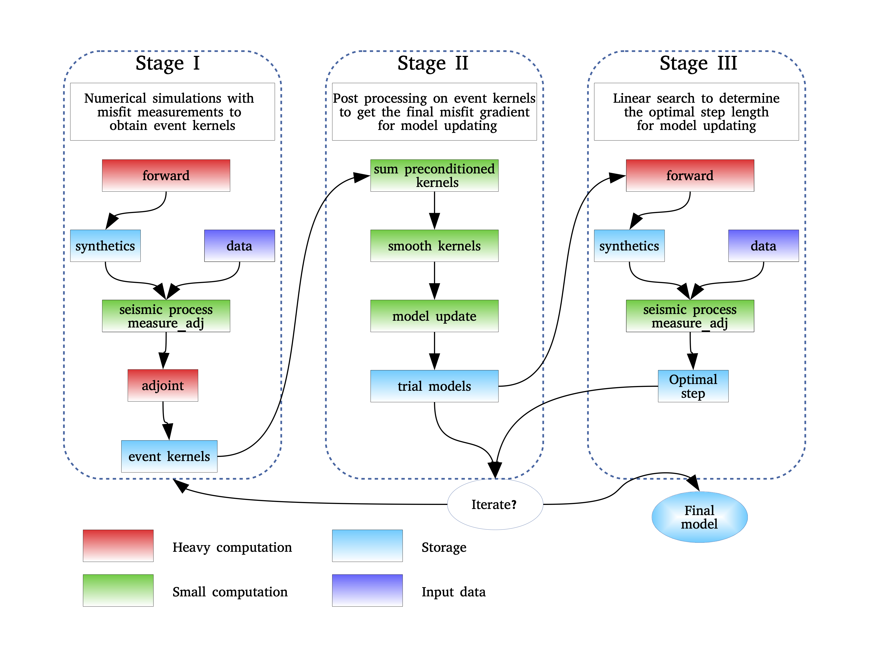

Introduction
============

The basic idea of **FWAT** is to iteratively minimize the misfit function of measurements between data and synthetics.
According to the job submission schedule, the inversion can be divided into three stages as shown in Figure 1.
In **Stage I**, both forward and adjoint simulations are conducted in one PBS/SLURM job (including misfit measurement) 
to obtain the event kernel of each virtual source (or master station). After all the simulations are finished,
event kernels are summed, preconditioned, and smoothed in **Stage II** to obtain the final misfit gradient. 
In **Stage III**, a line search method is adopted to determine the optimal step length for model updating.

    Figure 1. Workflow of FWAT.

**FWAT** will generate six main programs in the bin directory:

- `xfwat0_forward_data` is a forward only MPI program, normally used for synthetic tests.
- `xfwat1_fwd_measure_adj` is a MPI program for Stage I
- `xfwat2_postproc_opt` is a MPI program for Stage II
- `xfwat3_linesearch` is a MPI program for Stage III
- `xfullwave_adjoint_tomo` is not finished yet and planned to combine xfwat1, xfwat2 and 
  xfwat3 for fast computations of small-scale inversions.
- `xmeasure_adj` is a single program to test the measure_adj

Developer
---------

**Lead developer**

**Kai Wang**, wangkaim8@gmail.com 

  The FWAT package (version 1.0) was first developed by Kai Wang during his postdoc period at Macquarie University (2020/2-present) and the University of Toronto (2018/12-2019/12).
  Then, this inversion package has been tested across several seismic projects in Prof. Liu Qinya's group.

**Contributors**

*Bin He*, binhebj@gmail.com, joined in Mar 2021.

 Modified files that interface with the SPECFEM3D package to update the FWATv1.0 to version 1.1. 

*Nanqiao Du*, jointed in Nov 2021. 

*Mijian Xu*, jointed in Jan 2022.

Citations
---------

Changelog
---------

*FWAT-v1.1*, released on Mar 24, 2021

Main contributors: Bin He, Kai Wang

- Update FWAT to the latest stable version of SPECFEM3D released on 2018-08-30.
- Update FWAT.PAR.

*FWAT-v1.0*, released on Oct 6, 2020

Main contributor: Kai Wang

- Noise FWI, teleFWI and their joint inversion. Codes tested in central California (Wang et al., 2020, JGR)
- First version of the inversion workflow based on SPECFEM3D released on 2018-02-11.

Support
-------
**Kai Wang** was supported by the Postdoctoral Fellow program (2020/2-2021/12) at Macquarie University founded by the Australian Research Council Discovery Grant DP190102940.

**Kai Wang** was supported by the Postdoctoral Fellow program (2018/12-2019/12) at the University of Toronto founded by NSERC Discovery Grant 487237. 

Future update plan
------------------

There are several aspects can be considered for improvements in the future, including:

#. Add an inversion option for local earthquake (leq) tomography (``onging``).
#. Add CMT3D for source inversions prior to structure inversions (``onging``).
#. Add multicomponent ANAT.
#. Update optimize to invert for azimuthal anisotropy.
#. Python tool for model visualization.

