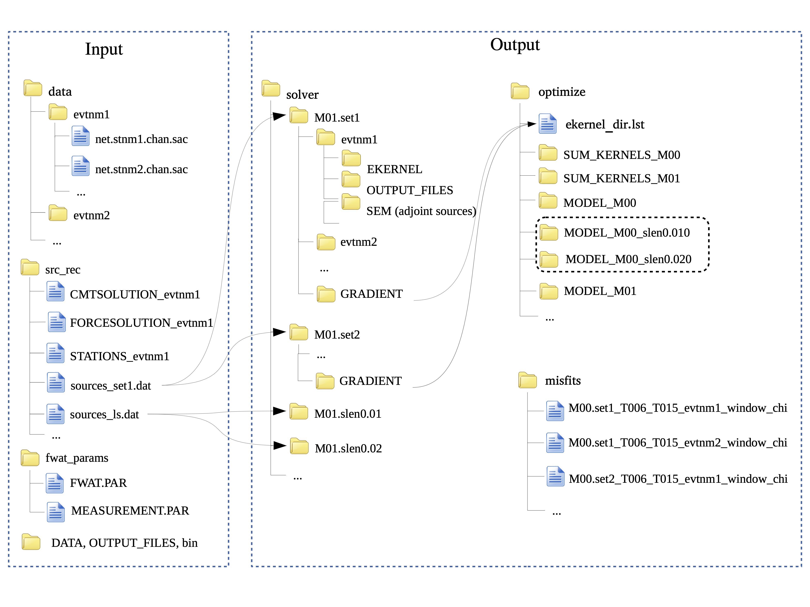

3. Package structure
======================

The **FWAT** package consists of some workflow-control parameter files and bash scripts in several folders.
The structure of FWAT is summarized in Figure 2.

    Figure 2. Structure of FWAT.

Terminology
-----------
* net:   network name, such as CI, TA, ...
* stnm:  station name, such as CC01, CC02, ...
* chan:  channel name, such as BXZ, ...
* evnm:  event name
* slen:  step length
   

Inputs
--------

- **data** contains sub-directories of seismic waveforms stored by event names. All the data
  are in SAC format and named as ./data/evtnm/net.sta.chan.sac, where evtnm and net are event and
  network names, sta is station, chan is the channel. For example, ./data/CI.STC_Z/CI.BAK.BXZ.sac
  is the EGF between a vertical virtual source CI.STC and a general station CI.BAK for vertical
  components. ./data/P1/TO.CC01.BXZ.sac is the vertical component waveform recorded by station
  TO.CC01 from a teleseismic event named P1. 

.. note::

   CCFs requires sac headers: knetwk kstnm kcmpnm dist az baz stlo stla evlo evla.
   Remember to remove zero/NaN traces because it will cause errors when applying normalization to CCFs.

   Use the script `rewrite_sac_header.bash` to rewrite sac headers and remove zero/NaN traces.

- **src_rec** stores all source and station information needed for the inversion. There are generally 
  three types of files prepared for the `SPECFEM3D Cartesian`, namely CMTSOLUTION_evtnm, FORCESOLUTION_evtnm,
  and STATIONS_evtnm. The format of these files should be the same as described in the user manual of
  `SPECFEM3D Cartesian`. The other two files called by **FWAT** are  sources_set?.dat+ and sources_ls.dat.
  sources_set?.dat is the name list of events (or virtual sources), which are used for making directories
  for simulations by event name. We can divide the events into different sets, such as set1, set2, ..., etc.
  sources_ls.dat contains the event names for line searches. The format of this two source list is:

.. code-block:: bash

  event name | latitude | lon | elevation | bury depth
  BK.KCC_Z 37.323600 -119.318700 888.000000 0.0
  BK.PACP_Z 37.008000 -121.287000 844.000000 0.0
  BK.PKD_Z 35.945200 -120.541600 583.000000 0.0
  CI.ARV_Z 35.126900 -118.830100 258.000000 0.0
  CI.BAK_Z 35.344400 -119.104400 116.000000 0.0
  CI.CAR_Z 35.308200 -119.845800 765.000000 0.0

- **DATA**, **OUTPUT_FILES**, **bin**. These three inputs are essential for launching numerical simulations
  for `SPECFEM3D Cartesian`. Please refer to the user manual of `SPECFEM3D Cartesian` for the details.
- **fwat_params** contains input parameters for **FWAT**. There are two files including FWAT.PAR and
  MEASUREMENT.PAR.

Outputs
-------

- **misfits** stores all the misfits files for a specific model. For example, all misfits of event set1
  for model M01 are stored as ./misfits/M01.set1_T006_T015_evtnm1_window_chi.
- **optimize** is where postprocessing procedure applied. All event kernels are processed in the 
  directories SUM_KERNELS_M??, and model updating files are stored in MODEL_M??.
- **solver** is where numerical simulations are performed and stored. For evtnm1 in the source list
  set1, the forward simulation root directory is ./solver/M01.set1/evtnm1. For line search at step
  length of 0.010, the corresponding directory is ./solver/M01.slen0.010/evtnm1.

Example scripts
----------------

Driven scripts
~~~~~~~~~~~~~~~
- `submit_job_fwat1.sh` is the driven script for running forward and adjoint simulations in **Stage I**.
  This script will call the PBS script `pbs_fwat1_fwd_measure_adj.sh` or SLURM script `sbash_fwat1_fwd_measure_adj.sh`
  and the results are stored in the directories **solver** and **misfit**.
- `submit_job_fwat2.sh` is the driven script to perform postprocessing of kernels and optimization
  for model update in **Stage II**. It will call the PBS script `pbs_fwat2_postproc_opt.sh` or SLURM 
  script `sbash_fwat2_postproc_opt.sh` and the results are stored in the directories **optimize**.
- `submit_job_fwat3.sh` is the driven script to do forward simulations for a linear search in **Stage III**.
  This script will call the PBS script `pbs_fwat3_linesearch.sh` or SLURM script `sbash_fwat1_linesearch.sh`
  and the results are stored in the directories **solver** and **misfits**.

fwat_params
~~~~~~~~~~~~

Examples of `FWAT.PAR` and `MEASUREMENT.PAR`

Plot
~~~~~~

- **plots** contains some example scripts for plotting misfit, model, kernel, waveform.

